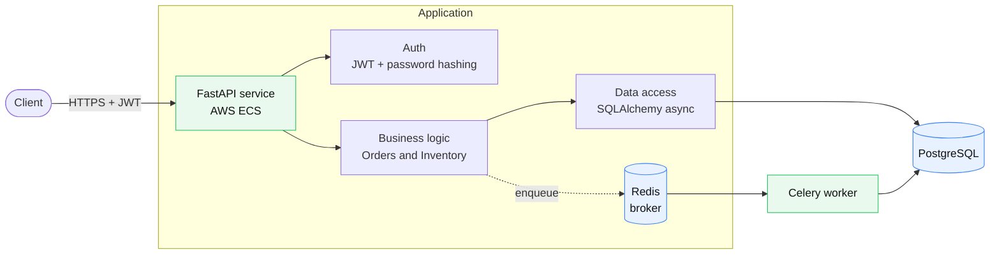
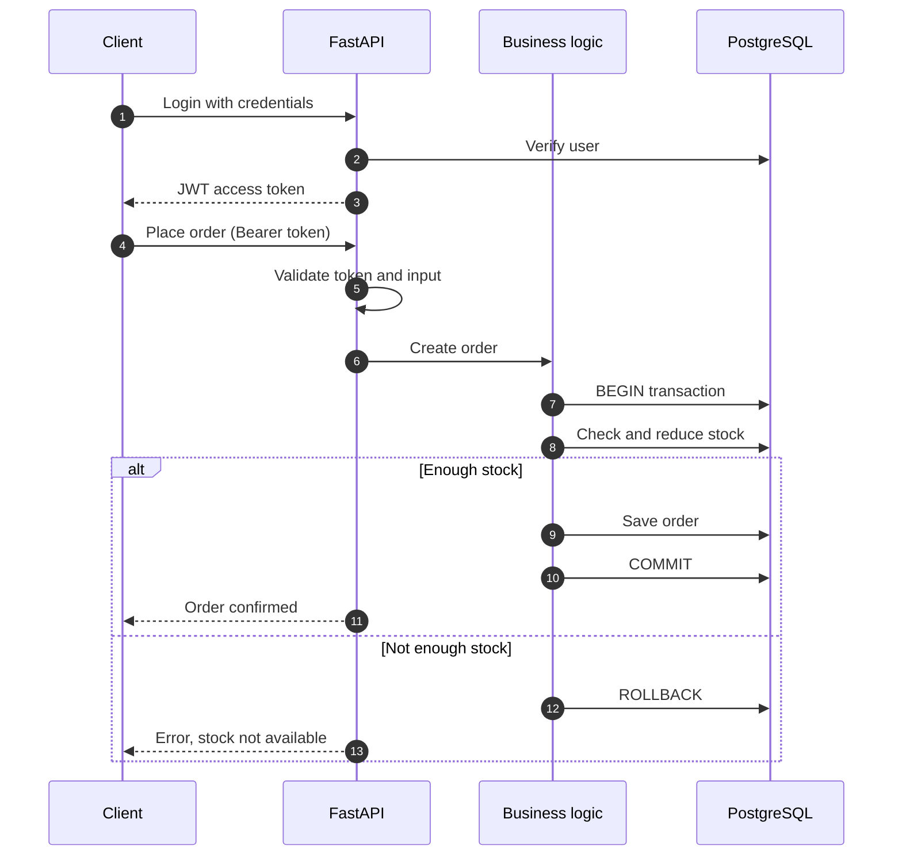
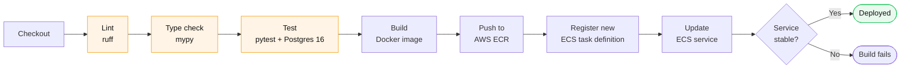

# Order & Inventory Management System

A backend system for managing products, stock and customer orders. It is built with **FastAPI** and **PostgreSQL**, uses **JWT authentication**, and is deployed to **AWS ECS** through a **Jenkins CI/CD pipeline**.

---

## Features

- Async REST API with automatic Swagger docs
- JWT authentication with hashed passwords
- Async PostgreSQL access with SQLAlchemy 2 and asyncpg
- Database migrations with Alembic
- Background jobs with Celery and Redis
- Linting (ruff), type checking (mypy) and tests (pytest) in CI
- Containerized with Docker, deployed to AWS ECS from Jenkins

---

## System architecture

---

## Order flow

---

## CI/CD pipeline

Every push to `main` runs this Jenkins pipeline (`Jenkinsfile`):

- **Image tag:** the Git commit hash, so every deployment can be traced to code.
- **Tests:** run against a real PostgreSQL 16 container, not a mock.
- **Region:** `ap-south-1` (Mumbai).
- **Rollout:** a new ECS task definition is registered, then the service is updated and Jenkins waits until it is stable.

---

## Tech stack

| Layer | Tool |
|---|---|
| API | FastAPI, Uvicorn, Pydantic v2, pydantic-settings |
| Database | PostgreSQL, SQLAlchemy 2 (async), asyncpg |
| Migrations | Alembic |
| Auth | JWT (python-jose), Argon2 / bcrypt password hashing |
| Background jobs | Celery, Redis |
|